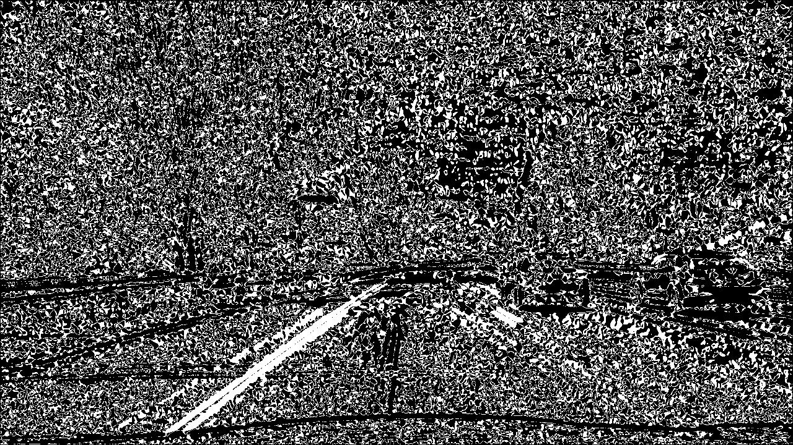
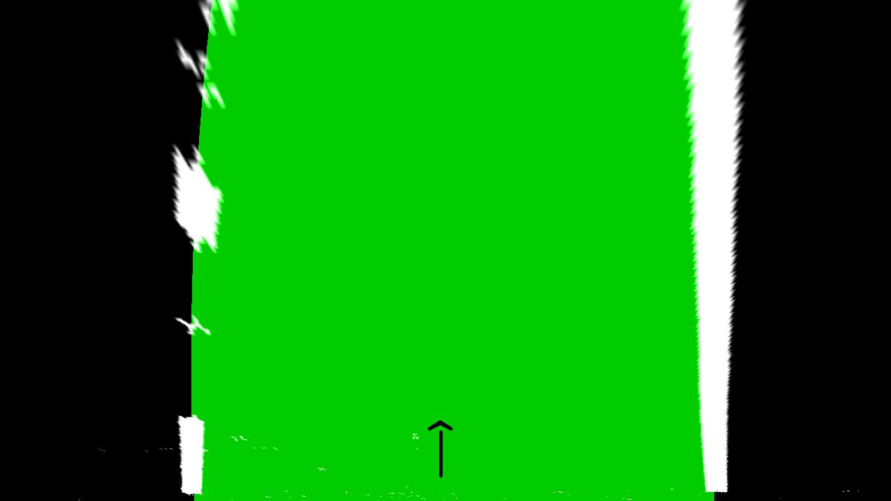
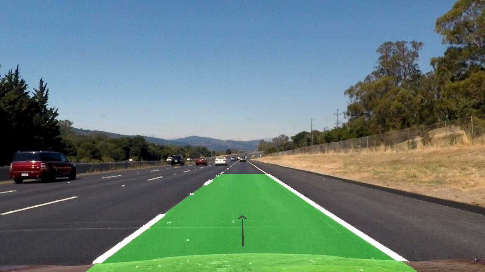

# Advanced Lane Finding

 

## Objective
The primary objective of this project is to design and implement a software pipeline capable of accurately identifying lane boundaries within a video stream.
The gif on the left is an example of the input video stream, while the gif on the right is the output of the software pipeline.

## Key technologies
The pipeline is implemented in Python 3.7, using Jupyter Notebook as the development environment.  

The key libraries used in this project are:
* **OpenCV** - for image processing (e.g. color filtering, gradient filtering, perspective transformation, etc.)
* **Numpy** - for numerical operations (e.g. matrix operations, etc.)
* **Matplotlib** - for plotting and visualization
* **MoviePy** - for video processing

## Pipeline steps
---

The pipeline was applied to each frame of the input video stream. The following steps were performed on each frame:

<ol>
    <h3><li>Compute the camera calibration matrix and distortion coefficients given a set of chessboard images.</h3>
        

            
             <em>Fig.1 - Transformation from distorted (left) to undistorted chessboard image (right) after correcting for distortion.</em>
        

    </li>
    <h3><li>Apply a distortion correction to raw images.</h3>
        

            
             <em>Fig.2 - Transformation from distorted (left) to undistorted image (right).  Hint: look at how the front of the car is now different.</em>
        

    </li>
    <h3><li>Use color transforms, gradients, etc., to create a thresholded binary image.</h3>
        

            
             <em>Fig.3 - An image where the hightlighted pixels are parts of the grayscaled image where the change in brightness (gradient magnitude) is above a certain threshold.</em>
        

        

            
             <em>Fig.4 - An image where the hightlighted pixels are parts of the grayscaled image where the direction of highest change in brightness (direction of the gradient) is within the desired threshold to match lane lines.</em>
        

        

            
             <em>Fig.5 - An image where the hightlighted pixels are parts of the image where the gradient magnitude is above a certain threshold, AND the gradient direction is within a desired threshold to match lane lines.</em>
        

        

            
             <em>Fig.6 - An image where the color filtering for yellow and white (both lane line colors) was applied (result in red pixels), and combined with a desired gradient (pixels in green). Yellow parts are where both filters agreed.</em>
        

    </li>
    <h3><li>Apply a perspective transform to rectify binary image ("birds-eye view").</h3>
        

            
             <em>Fig.7 - The lane lines with green dots on each corner must land where the yellow dots are to form the birds-eye view. This image will be used to get such transformation matrix.</em>
        

        

            
             <em>Fig.8 - Top view of the road. Left: original image. Center: color and gradient filter. Right: Only color filter.</em>
        

    </li>
    <h3><li>Detect lane pixels and fit to find the lane boundary.</h3>
        

            
             <em>Fig.9 - Histogram of the bottom half of the image. The peaks are the most likely positions of the lane lines.</em>
        

        

            
             <em>Fig.10 - The lane lines are highlighted in red (left line) and blue (right line), with the lane itself in green. The estimate of the radius of curve and direction of the center of curvature is also shown.</em>
        

    </li>
    <h3><li>Warp the detected lane boundaries back onto the original image.</h3>
        

            
             <em>Fig.11 - Detected lane and its lines projected on the original undistorted image. The lane lines are highlighted in red (left line) and blue (right line), with the lane itself in green. The estimate of the radius of curve and direction of the center of curvature is also shown.</em>
        

    </li>
    <!-- <h3><li>Output visual display of the lane boundaries and numerical estimation of lane curvature and vehicle position.</h3></li> -->
</ol>

## Results
Apart from the gif at the beginning of this README, a more challenging video was also processed, as seen in the gifs below:

    
    
     <em>Fig.12 - Challenge video input (left) and result (right).</em>

## Discussion and future improvements
The pipeline was able to successfully identify the lane boundaries in the input video stream. However, there are still some limitations to the current implementation. For example, the pipeline may not work well under different lighting conditions, or when the road has a lot of shadows, as it was observed on the more challenging video above. The pipeline may also fail when there are other objects on the road that are similar in color to the lane lines. Future work could focus on improving the robustness of the pipeline under different conditions, and making it more efficient.